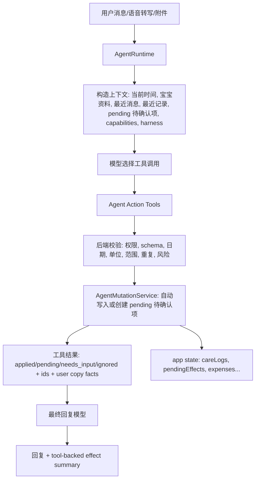

# 小宝记 Agent Tool-first 记录架构迁移 Spec v0.1

- 创建日期：2026-06-06
- 状态：已实施（2026-06-07 完成 retained Records/Ledger AI write path cutover；未发布）
- 适用范围：后端 Agent Runtime、内部工具调用、记录/账本副作用、Agent benchmark、L2 app-state 验证
- 产品边界：继续坚持“记录和陪伴”，不引入电商、专家、知识付费或开放社区
- 相关文档：`harness/agent-model-context-harness.md`、`backend/src/main/resources/agent/capability-manifest.json`、`docs/agent-detailed-design.md`、`docs/app-function-coverage-index.md`

## 实施记录（2026-06-07）

- 已新增后端 action tool 体系，核心目录为 `backend/src/main/java/com/xiaobao/babycompanion/agent/action/`。
- 已新增 `AgentMutationService`，统一负责 agent action 的 `careLogs` 写入和 `pendingEffects` 创建。
- 已实现并接入：
  - `record_feeding_event`
  - `record_sleep_event`
  - `record_diaper_event`
  - `record_temperature_event`
  - `create_growth_measurement_pending`
  - `create_milestone_pending`
  - `create_expense_pending`
- 已从生产主代码删除旧写链路类：
  - `RecordSignalExtractor`
  - `EffectPolicy`
  - `CareEventCompletenessPolicy`
- 已移除旧 effect apply L2 本地模拟脚本，L2 unit 改为 action-result / backend app-state 语义。
- 已通过验证：
  - targeted Maven action-tool/runtime tests
  - `mvn -f backend/pom.xml test`
  - `npm run test:agent-benchmark`
  - `npm run test:agent-l2:unit`
  - `npm run verify:frontend`
- 本次没有执行 ECS 或 OTA 发布。

## 0. 背景

最近几轮真实用户路径暴露了同一类根因：

1. 用户说了完整记录事实。
2. 模型文案能复述甚至承诺“已整理成待确认草稿”。
3. 真实 `effectDecisions`、`pending_effect` 或最终记录却没有同步生成，或只生成了一部分。

典型坏例：

- 用户先说“这周二量了一下小宝的体重是5.54公斤”，再说“身高是64厘米”。模型回复说已整理草稿，但当时没有产生真实成长测量草稿。
- 用户说“刚才的这些成长记录再帮我记一遍”，模型能从上下文复述体重和身高，但当时 `effectDecisions=[]`。
- 用户说“上周小宝的体重是5.4公斤，身高是也是64厘米”，模型回复“上周（6月2日）”，但 `2026-06-02` 实际是这周二，不是上周；并且真实 decision 只包含体重，没有身高。

这些问题不能继续靠补某一个正则或某一个 bad case 解决。当前架构把“理解用户自然语言”和“决定系统副作用”拆错了位置：模型负责说，服务端规则负责真动作，最后容易出现“说到了但没做到”。

## 1. 目标

本轮迁移目标：

1. 让 AI 根据系统能力主动调用记录工具，而不是主要依赖服务端 deterministic extractor 兜底生成副作用。
2. 把所有可变更系统状态的能力收敛为受控工具，工具负责校验、权限、幂等、落库或生成待确认项。
3. 最终回复必须基于工具执行结果，不能再出现“文案承诺记录，但系统没有记录/待确认项”的情况。
4. 保留低焦虑体验：字段完整的低风险照护记录自动写入；成长测量和账本先以持久化待确认项为主。
5. 让 bad case 进入 harness 和 benchmark，而不是继续堆进业务正则。
6. 当前保留的记录/账本 AI 写入能力同批迁移到 action tools；不保留一半旧链路、一半新链路的生产状态。

## 2. 非目标

本轮不做：

- 不新增电商、专家、问诊、知识付费、开放社区。
- 不允许 AI 直接修改或删除历史成长数据、照护记录、账本或宝宝资料。
- 不做完整工作流编排平台；只做当前 Agent 记录和账本链路需要的工具化能力。
- 不做提醒/待办相关 Agent 能力。模型不再获得 `set_reminder` 这类工具，也不应承诺创建提醒或待办；现有非 AI 提醒入口若仍存在，属于独立产品能力，不在本架构迁移范围内。
- 不做旧链路兼容、shadow oracle、逐域灰度或新旧双写。旧链路要么删除，要么完全退出生产写入链路。
- 不保留未迁移的 AI 写入承诺。若某项能力暂时没有 action tool，就从 prompt/capability manifest 中移除，并让模型给出手动入口或 unsupported 边界。
- 不把 harness 改成全 JSON。人类维护的产品语境和 bad case 仍使用中文 Markdown；模型 function calling 的工具参数 schema 必须是机器可校验 JSON Schema。

## 3. 当前架构问题

### 3.1 当前链路

当前普通 chat/stream 大致链路：

1. `AgentRuntime` 调 `RecordSignalExtractor.extract(message, recentMessages)` 得到 `RecordSignals`。
2. `AgentPlanner` 根据用户消息、`RecordSignals`、harness、capability manifest 生成 plan。
3. Runtime 调用少量工具，目前主要是 `web_search`，记录类能力没有真正作为工具暴露。
4. 最终模型生成 JSON：`aiText`、`careLogPatch`、`growthEvent`、`reminders`、`memories`、`expenses` 等。
5. `EffectPolicy.decide(...)` 再把模型草稿和 `RecordSignals` 合并成 `effectDecisions`。
6. 前端收到 `effectDecisions` 后，低风险 auto 写到具体集合，pending 聚合成 `pendingEffects` 再持久化。

### 3.2 根因

当前问题不是模型完全不懂，而是“权威动作来源”不清晰：

- 成长测量没有在最终 response schema 中作为模型可直接表达的结构化字段，只能靠 `RecordSignalExtractor.growthMeasurementSignals(...)`。
- 模型即使在文案里说对了，也不一定转化成 `effectDecisions`。
- `EffectPolicy` 最终重新生成决策，模型 `effectDecisions` 不是权威副作用来源。
- 前端还要把 `effectDecisions` 二次组装成 `pendingEffects`，增加了“后端说有、前端没显示、数据库没落”的裂缝。
- 复杂日期如“上周”“这周二”“刚才”“前面”“也是”本质是语义理解问题，不适合继续用服务端正则扩张。

## 4. 目标架构

目标是 Tool-first Agent Actions：



核心原则：

- 模型负责理解用户语义和选择工具。
- 工具负责真实系统能力、校验和状态变更。
- 最终回复只能引用工具结果里的事实。
- `RecordSignalExtractor` 不再参与主链路记录决策。P0 实施时从 `AgentRuntime` 写入链路移除；如果没有其他非记录用途，直接删除。
- `EffectPolicy` 不再参与主链路副作用生成。P0 实施时从 `AgentRuntime` 移除；工具校验由新的 tool validator / mutation service 承担，能删的旧代码直接删掉。

### 4.1 Tool 的形态

这里的 tool 不是 CLI，也不是暴露给前端或外部系统直接调用的公网 API。

它是后端 Agent Runtime 内部注册给模型 function calling 的受控函数：

1. 后端把每个 tool 的 `name`、`description`、JSON Schema 参数声明传给模型。
2. 模型只返回 tool call，例如 `create_growth_measurement_pending({...})`。
3. 后端 JVM 内的 `AgentActionTool` 实现接收参数，调用应用服务完成校验、幂等、写入或创建待确认项。
4. 工具返回结构化 `AgentActionResult`。
5. 最终回复模型只能基于 `AgentActionResult` 生成中文回复。

外部可见边界：

- 前端不直接调用这些 tool。
- 前端只调用现有聊天接口和 app state 接口。
- 数据写入不经过 CLI。
- 如果后续需要调试，可以增加只读 trace/debug endpoint，但不能作为产品写入入口。

### 4.2 技术实现细节

后端已有 `AgentTool` / `ToolRegistry` / `WebSearchTool` / `DeepSeekTool` 这套 function calling 基础设施。新的记录和账本 tool 不直接复用 `web_search` 的语义，但可以沿用同一类技术形态：Spring Bean 注册、JSON Schema 暴露给模型、后端解析 tool call、JVM 内执行。

建议落地为一套独立的 action tool 体系，避免和外部查询工具混在一起：

```java
public interface AgentActionTool {
    String name();
    String displayName();
    DeepSeekTool definition();
    AgentActionResult execute(AgentActionCall call, AgentActionContext context);
}
```

核心类建议：

| 类 | 职责 |
| --- | --- |
| `AgentActionTool` | 单个记录/账本工具接口，返回 function calling schema 并执行工具 |
| `AgentActionRegistry` | Spring 注入所有 `AgentActionTool`，按工具名查找 |
| `AgentActionExecutor` | 解析模型 tool calls、执行工具、捕获失败、写 trace |
| `AgentMutationService` | 统一做真实写入：创建 `pending_effect`、写 `care_log`、创建账本待确认项、幂等 |
| `AgentActionValidator` | schema 后的业务校验：日期精度、单位、范围、重复、高风险边界 |
| `AgentActionResult` | 工具执行事实，供最终回复和前端 app state 同步使用 |

模型侧看到的是 function declaration，例如：

```json
{
  "type": "function",
  "function": {
    "name": "create_growth_measurement_pending",
    "description": "为宝宝身高、体重、头围创建持久化的待确认成长测量项。日期不精确时必须返回 needs_input，不得臆造日期。",
    "parameters": {
      "type": "object",
      "properties": {
        "date": {"type": ["string", "null"]},
        "dateSourceText": {"type": "string"},
        "datePrecision": {"type": "string", "enum": ["exact", "day", "week", "month", "relative", "unknown"]},
        "measurements": {
          "type": "array",
          "items": {
            "type": "object",
            "properties": {
              "type": {"type": "string", "enum": ["height", "weight", "headCircumference"]},
              "value": {"type": "number"},
              "unit": {"type": "string", "enum": ["cm", "kg", "jin"]},
              "sourceText": {"type": "string"}
            },
            "required": ["type", "value", "unit", "sourceText"],
            "additionalProperties": false
          }
        }
      },
      "required": ["date", "dateSourceText", "datePrecision", "measurements"],
      "additionalProperties": false
    }
  }
}
```

运行时流程：

1. `AgentRuntime` 构造 `AgentActionContext`：当前时间、时区、用户/家庭身份、宝宝资料、最近消息、最近记录、已有 pending 待确认项、capability manifest、harness。
2. `AgentRuntime` 发起 tool-call 模型请求，`tools` 只包含本轮允许的记录/账本工具：P0 写入工具为 `record_feeding_event`、`create_growth_measurement_pending`、`create_expense_pending`；只读查询工具预留为 `read_family_records` / `read_family_ledger`，不作为 P0 必交付，不产生副作用。
3. 模型返回 `tool_calls`。如果用户是提醒/待办请求，因为工具列表没有相关工具，模型不能调用；最终回复只能说明当前聊天不处理提醒/待办。
4. `AgentActionExecutor` 按顺序执行每个 tool call。每个工具先把 JSON 参数解析成强类型 DTO，再调用 `AgentActionValidator`。
5. 校验通过后，工具调用 `AgentMutationService`，在事务里写入真实数据：
   - 低风险喂养：写 `care_log`。
   - 成长测量：写 `pending_effect.growthMeasurements`，返回 `pending_created`。
   - 文本账本：写 `pending_effect.expenses`，返回 `pending_created`。
6. `AgentMutationService` 使用幂等键避免重试重复写入。
7. 每个工具返回 `AgentActionResult`，包含 `status`、`recordIds`、`pendingEffectId`、用户可见事实摘要和 warnings。
8. 最终回复模型收到 `actionResults`，只能基于这些结果说“已记好”“待确认”“还需要补充”。

事务和幂等：

```text
idempotencyKey = familyId + userId + traceId + toolCallId + toolName + normalizedPayloadHash
```

- 如果同一 tool call 因 stream 重试重复执行，直接返回第一次执行结果。
- `pending_effect`、`care_log`、`expense_item` 的写入都由 `AgentMutationService` 控制。
- 工具不直接拼 SQL，不直接访问 Controller，也不走 CLI。

和 API 的关系：

- 聊天入口仍然是现有 `/api/agent/chat` 或 `/api/agent/stream`。
- 前端仍然通过 `/api/app/state` 读取最终状态。
- action tools 是 Agent Runtime 内部能力，不新增给前端直接调用的 REST API。
- 如需线上排查，可在 `agent_run` 中记录 action request/result JSON；也可以增加登录态只读 trace endpoint，但不能通过它写数据。

## 5. 工具能力设计

### 5.1 通用工具结果

所有记录工具返回统一结构：

```json
{
  "status": "applied|pending_created|needs_input|ignored|rejected|failed",
  "capabilityId": "log_growth_measurement",
  "mutationType": "careLog|growthMeasurement|growthEvent|expenseItem|none",
  "recordIds": ["string"],
  "pendingEffectId": "string|null",
  "facts": {
    "date": "YYYY-MM-DD|null",
    "dateSourceText": "string",
    "datePrecision": "exact|day|week|month|relative|unknown",
    "summary": ["string"]
  },
  "userMessage": "自然中文，用于最终回复参考",
  "warnings": ["string"]
}
```

规则：

- `applied` 表示已经真实写入最终集合，例如低风险喂养记录进 `careLogs`。
- `pending_created` 表示已经真实创建 `pending_effect`，前端刷新 app state 后必须能看到待确认卡。
- `needs_input` 表示字段不足，需要追问。
- `ignored` 表示不应生成记录，例如截图描述、重复记录、只读查询。
- `rejected` 表示越权、危险或系统不支持。
- `failed` 表示工具执行失败，最终回复必须说明失败，不能说已记录。

### 5.2 工具粒度和命名约定

工具粒度按“系统动作”拆，而不是按大领域塞进一个万能参数包。

命名规则：

| 命名 | 含义 | 示例 |
| --- | --- | --- |
| `record_*_event` | 字段完整、低风险时直接写入最终记录集合 | `record_feeding_event` |
| `create_*_pending` | 创建已持久化、可在 app state 看到的待确认项 | `create_growth_measurement_pending` |
| `recognize_*_pending` | 通过图片/附件识别后创建待确认项 | `recognize_expense_image_pending` |
| `read_*` | 只读查询，不产生副作用 | `read_family_records` |

`pending` 不是模型脑内草稿，也不是前端临时卡片。它必须满足：

- 已写入后端 `pending_effect`。
- 有稳定 id、owner、family、source message、tool trace。
- 前端刷新 `/api/app/state` 后仍可见。
- 用户确认后进入最终集合；用户取消或过期后仍有 trace 可查。

本 spec 不再使用 `draft` 作为工具命名。历史文案里可以出现“草稿”作为用户可理解的中文，但系统语义统一叫 `pending` / 待确认项。

### 5.3 `record_feeding_event`

用途：

- 处理母乳、配方奶、混合喂养、辅食等喂养记录。
- P0 优先覆盖奶量记录，因为它是最高频、且当前产品期望字段完整时自动写入。

输入字段：

```json
{
  "date": "YYYY-MM-DD",
  "dateSourceText": "今天|刚才|昨晚|用户原话",
  "time": "HH:mm|null",
  "timeSourceText": "刚才|9点多|十二点",
  "feedingType": "breast|formula|mixed|solid|unknown",
  "amountMl": 120,
  "solidName": null,
  "durationMinutes": null,
  "note": "喝完吐了|用户原话中的补充说明",
  "contextReference": {
    "kind": "current_message|recent_message|pending_effect",
    "messageIds": ["string"]
  }
}
```

后端行为：

- 奶类喂养必须至少有 `amountMl`。
- 混合喂养宝宝只说“喝奶 120ml”且没有奶类型时，返回 `needs_input`，追问母乳还是配方奶。
- 如果用户上一轮被追问奶类型，本轮回答“母乳/奶粉”，工具可以结合最近上下文补全上一条待记录事件。
- 字段完整、低风险时直接写入 `careLogs`，返回 `applied`。
- 吐奶等补充信息可以作为同一条 feeding event 的 note 一起写入，但最终回复不能暗示做了医疗判断。
- 写入后工具返回实际 care log id、event id、时间线摘要、今日奶量增量，最终回复只基于这些事实。

P0 验收：

- “刚才喝了120毫升母乳”写入当天时间线，今日奶量和时间线同步更新。
- 先说“喝了120毫升”，AI 追问奶类型，再答“母乳”，应补全上一轮事件并写入一条完整喂养记录。
- “刚才9点多喝了100毫升奶粉，喝完吐了”应写入 100ml 配方奶，并把“喝完吐了”作为 note；时间线和统计一起更新。
- 纯文本最终回复不允许说“已记好”除非 `record_feeding_event.status=applied`。

### 5.4 `create_growth_measurement_pending`

用途：

- 处理身高、身长、体重、头围等成长测量。
- 一次工具调用可以包含多个测量项，避免一条消息里只取到第一个指标。
- 成长测量默认创建待确认项，不直接写入最终成长数据。

输入字段：

```json
{
  "date": "YYYY-MM-DD|null",
  "dateSourceText": "今天|这周二|上周|刚才那条|用户原话",
  "datePrecision": "exact|day|week|month|relative|unknown",
  "measurements": [
    {
      "type": "height|weight|headCircumference",
      "value": 64,
      "unit": "cm|kg|jin",
      "sourceText": "身高也是64厘米"
    }
  ],
  "contextReference": {
    "kind": "current_message|recent_message|pending_effect|existing_record",
    "messageIds": ["string"]
  }
}
```

后端行为：

- `datePrecision=exact|day` 且日期有效：创建 `pending_effect.growthMeasurements`。
- `datePrecision=week|month|unknown`：返回 `needs_input`，追问具体日期；不得借用上一条具体日期。
- “上周”在 `2026-06-06` 这天只能理解为上一个自然周，不得落到 `2026-06-02`。
- “这周二”在 `2026-06-06` 这天可解析为 `2026-06-02`。
- 如果用户明确说“刚才/前面那条成长记录再记一次”，可以引用最近消息或 pending 待确认项，但不能覆盖当前消息里的新时间表达。
- 体重单位缺失时返回 `needs_input`，追问斤还是公斤。
- 异常值返回 `needs_input` 或 `rejected`，不创建待确认项。
- 同日同类型同值已存在时返回 `ignored`，提示不重复维护。

P0 验收：

- “这周二体重5.54公斤，身高64厘米”创建一个 pending effect，里面有两条 growth measurement。
- “上周体重5.4公斤，身高64厘米”不创建 `2026-06-02` 待确认项，必须追问具体日期。
- “身高是也是64厘米”这种口语瑕疵仍应被模型理解为 height=64cm，工具 schema 校验通过。
- 最终回复说“两个待确认项”时，工具结果里必须确实有两个 measurement。

### 5.5 `create_expense_pending`

用途：

- 处理育儿支出文本记账，例如“今天给小宝买奶粉花了268元”。
- P0 先覆盖文本账本待确认项；图片订单/小票识别复用现有 expense-recognition skill，放到 P1 收敛。

输入字段：

```json
{
  "date": "YYYY-MM-DD",
  "dateSourceText": "今天|昨天|用户原话",
  "items": [
    {
      "title": "奶粉",
      "amount": 268.0,
      "currency": "CNY",
      "category": "formula|diaper|food|clothing|toy|health|vaccine|daily|education|other",
      "quantity": null,
      "unitPrice": null,
      "merchant": null,
      "sourceText": "给小宝买奶粉花了268元"
    }
  ]
}
```

后端行为：

- 金额和用途完整时创建 `pending_effect.expenses`，不直接入账。
- 缺金额或用途时返回 `needs_input`。
- 分类可由工具按用途推断；不确定时用 `other`，不要追问分类。
- 重复账本待确认项或已确认账本应返回 `ignored`，不重复生成。
- 用户只是问商品价格、商品信息、在哪里买，不创建账本待确认项。

P0 验收：

- “今天给小宝买奶粉花了268元”创建一条账本待确认项。
- “买了奶粉，帮我记账”追问实际金额。
- “这个奶粉现在多少钱”不创建账本待确认项。

### 5.6 后续记录/账本工具

P1 细分工具：

| Tool | 场景 | 默认行为 |
| --- | --- | --- |
| `record_sleep_event` | 睡着、醒来、睡了多久 | 时间完整时写入；缺起止或时长时 `needs_input` |
| `record_diaper_event` | 便便、尿尿、换尿布 | 低风险直接写入 |
| `record_temperature_event` | 体温、发烧、退烧 | 记录事实，但异常体温必须带 warning，不做诊断 |
| `create_growth_event_pending` | 翻身、抬头、会坐、会爬等里程碑 | 创建成长事件待确认项 |
| `recognize_expense_image_pending` | 订单、小票、支付截图 | Pro/图片能力，识别后创建账本待确认项 |
| `read_family_records` | 查询今天/最近喂养、睡眠、成长数据 | 只读，不产生 mutation |
| `read_family_ledger` | 查询近期账本、分类花费、待确认账本 | 只读，不产生 mutation |

P2：

- 收敛旧的非工具化账本/记录逻辑。
- 评估相册是否需要独立 tool；本轮不做。
- 提醒/待办、长期记忆不进入本次 Agent tool 迁移范围；模型工具列表中不暴露相关能力。

## 6. 日期和时间语义

所有工具都必须接收 `currentDateTime`、`timeZone` 和用户原始 `dateSourceText/timeSourceText`。

日期规则：

- 具体日期、今天、昨天、这周二、本周二：可以转成 `datePrecision=day`。
- “上周”“这周”“上个月”只有范围，没有具体测量日：对成长测量必须追问具体日期。
- “刚才”“前面”“刚刚那条”是上下文引用，不是日期本身；只能指向可追溯的最近消息、pending 待确认项或已有记录。
- 如果当前消息包含新的日期表达，当前消息优先于上下文借日期。
- 模型和工具都必须保留原始表达，便于 trace 和用户解释。

时间规则：

- 具体时间点用于照护时间线。
- “十二点/12点”必须结合当前时间判断更可能是 `00:00` 还是 `12:00`，并保留 `timeSourceText`。
- “9点多”可以落到近似时间，但最终 note 要保留“9点多”，不要伪装成用户精确说了 `09:00`。
- 没有具体时间时，事件 `time=null`，不臆造。

## 7. 后端执行边界

### 7.1 权限

- 所有写入和待确认项创建必须要求 caregiver 权限。
- 所有状态读取和写入必须限定当前 family/user。
- 私有 pending effect 继续按 `owner_user_id` 隔离；本轮不新增提醒或记忆写入能力。

### 7.2 幂等

每个工具调用必须有稳定幂等键：

```text
traceId + toolCallId + capabilityId + normalizedPayloadHash
```

同一轮 stream 重试、前端重连或模型重复工具调用时，不得重复创建记录或 pending 待确认项。

### 7.3 校验

工具执行前必须校验：

- JSON schema。
- 日期合法性和精度。
- 单位和数值范围。
- 重复记录。
- 高风险健康/医疗边界。
- 系统能力是否 enabled。
- 是否属于不支持的历史修改/删除/撤销。

### 7.4 失败语义

- 工具失败时最终回复不能承诺已记录。
- 部分成功时必须说明具体成功了哪些，哪些还需要补充。
- 工具结果要写入 `agent_run`，便于线上排查“模型说了但系统没做”。

## 8. 前端交互和状态来源

P0 可以不重做聊天 UI，但必须调整状态来源：

- 后端工具创建的 pending effect 必须真实落到 `pending_effect`。
- 前端收到最终响应后刷新 app state 或消费 stream 中的 app-state delta。
- 前端不再从未持久化的 `effectDecisions` 自行组装 pending effect。
- 后端可以返回 `actionResults` 或 app-state delta 供前端展示，但它们只是工具执行事实，不是旧 `EffectPolicy` 兼容层。
- 前端如果看到同 id pending effect 已存在，只展示已有数据，避免重复卡片。
- 自动记录反馈卡只展示工具 `applied` 的事实。
- 待确认卡只展示已经持久化的 pending effect。

目标体验：

- 用户看到“已记好”，记录页一定能看到。
- 用户看到“待确认项”，刷新后仍能看到。
- 如果需要补充，卡片或回复只问缺失字段，不假装已记录。

## 9. 与现有 deterministic 规则的关系

本迁移不以旧链路兼容为目标。旧链路已经在真实用户路径中暴露出大量 bad case；继续保留 fallback 会让“模型说了、系统没做”的裂缝继续存在。

迁移后分层：

| 层 | 保留职责 | 不再承担 |
| --- | --- | --- |
| `RecordSignalExtractor` | 无主链路职责；P0 实施时从 runtime 写入链路移除，若没有剩余必要用途则删除 | 任何记录/账本事实抽取 |
| `AgentPlanner` | 构造上下文、决定是否进入 tool-call 阶段 | 直接决定最终副作用 |
| Tool Router / Model | 选择要调用的系统能力并填参数 | 绕过工具声称已记录 |
| Agent Action Tools | 校验、幂等、写入或创建待确认项 | 生成陪伴文案 |
| Final Composer | 基于工具结果生成自然中文 | 自行编造系统动作结果 |
| `EffectPolicy` | 无主链路职责；P0 实施时从 runtime 写入链路移除，能删则删 | 从自然语言生成副作用或作为 fallback |

迁移策略：

1. P0 合入点直接移除 `RecordSignalExtractor + EffectPolicy` 的生产写入职责。
2. 当前保留的记录/账本 AI 写入只走 action tools。
3. 工具返回 `applied|pending_created|needs_input|unsupported|rejected|failed` 后，不再追加 deterministic decision。
4. 工具路由失败时返回失败、追问或 unsupported，不 fallback 到 `RecordSignalExtractor + EffectPolicy`。
5. 删除旧正则测试和旧副作用生成代码；仅保留真正安全边界代码。

## 10. Benchmark 和验收

### 10.1 L0/L1 单元测试

新增：

- 工具参数 schema 解析测试。
- 日期精度测试：这周二、上周、刚才、前面、当前消息日期优先。
- 成长测量范围、单位、重复测试。
- 喂养记录奶类型追问、上下文补全、自动写入测试。
- 文本账本金额/用途/重复/只读价格查询测试。
- 旧链路禁用测试：成长测量、喂养、文本账本不得由 `RecordSignalExtractor + EffectPolicy` 生成主副作用。
- 幂等测试。

### 10.2 Agent benchmark

新增或迁移 case：

- `tool-routing-uses-specific-action-tool-not-generic-care-bag`
- `tool-growth-this-week-tuesday-multi-measurement`
- `tool-growth-last-week-needs-exact-date`
- `tool-growth-replay-recent-measurements`
- `tool-growth-text-tool-result-consistency`
- `tool-feeding-complete-auto-apply`
- `tool-feeding-mixed-needs-type`
- `tool-feeding-followup-type-completes-record`
- `tool-expense-text-pending`
- `tool-expense-missing-amount-needs-input`
- `tool-expense-price-query-no-pending`
- `tool-no-claim-without-tool-result`
- `tool-reminder-request-no-tool-no-mutation`

### 10.3 L2 app-state 验证

必须覆盖：

- AI 回复后 `pending_effect` 真实新增，前端/接口读取可见。
- 确认 pending effect 后进入 `growth_measurement`。
- 喂养自动写入后 `care_log.events`、今日统计、时间线一致。
- 文本账本待确认项进入 `pending_effect.expenses`，确认后进入 `expense_item`。
- 工具失败或 needs_input 不增长 `pendingEffects`、`growthMeasurements`、`careLogs`、`expenseItems`。

### 10.4 Live harness

模型付费 live benchmark 继续预算上限 20 CNY。

P0 live case 控制在 12-16 条，重点覆盖：

- 中文口语表达。
- 上下文引用。
- 日期歧义。
- 细分工具调用是否正确，不把喂养、成长测量、账本混进一个大工具。
- 多指标同句。
- 文本账本待确认项。
- 提醒/待办请求不产生 tool call 或 mutation。
- 文案与工具结果一致。

## 11. 发布计划

### P0：当前保留的记录/账本 AI 写入全量工具化

交付：

- `AgentActionTool` 抽象和 `AgentActionResult`。
- `record_feeding_event`。
- `record_sleep_event`。
- `record_diaper_event`。
- `record_temperature_event`。
- `create_growth_measurement_pending`。
- `create_growth_event_pending` / `create_milestone_pending`。
- `create_expense_pending`。
- `AgentMutationService`：负责 pending effect 创建、care log 写入、账本待确认项创建和幂等。
- Runtime 接入工具路由和最终回复工具结果。
- 移除 `RecordSignalExtractor + EffectPolicy` 在所有保留记录/账本 AI 写入上的主链路职责。
- 模型工具列表不暴露提醒/待办能力。
- Benchmark + L2 case。

发布：

- 后端发布到 ECS。
- 如果前端要从 `effectDecisions` 组装 pending effect 改为读取后端持久化 pending effect，需要 OTA，并按生产 base URL 防事故规则验证。

### P1：识别和只读能力扩展

迁移：

- `recognize_expense_image_pending`。
- `read_family_records` / `read_family_ledger`。

目标：

- 图片/订单/票据识别与只读查询也进入工具边界，但不恢复旧 effect 链路。

### P2：旧规则删除确认

收敛：

- 删除成长测量、喂养、睡眠、尿布、体温、成长事件和文本账本相关旧抽取规则，除非它们有完全独立的非 Agent、非写入用途。
- `EffectPolicy` 不再直接从 `RecordSignals` 创建任何记录/账本主副作用。
- 前端不再负责从未持久化 `effectDecisions` 构造 pending effect；后端成为 pending effect 权威来源。

## 12. 成功标准

本 spec 完成后的产品成功标准：

1. AI 说“已记录”，记录页一定能看到对应记录。
2. AI 说“待确认项”，`pending_effect` 一定真实存在。
3. AI 需要追问时，不创建伪待确认项。
4. “上周”这类不精确成长测量日期不会错误落到 `2026-06-02`。
5. 同一句多个成长指标不会漏其中一项。
6. 用户补充上一轮缺失字段时，系统能把上下文补齐成一条完整记录。
7. 账本文本请求生成待确认项，价格查询不误建账本。
8. 提醒/待办请求不再产生 Agent tool call 或 mutation。
9. 新 bad case 优先补 harness/tool validation/benchmark，不优先补自然语言正则。

## 13. 已确认决策

根据用户反馈，本 spec 已采用以下决策：

1. 本轮只聚焦记录和账本；AI 提醒/待办能力从工具列表和迁移范围中移除。
2. P0 包含当前保留的记录/账本 AI 写入细分工具：喂养、睡眠、尿布、体温、成长测量、成长事件/里程碑和文本账本；只读记录/账本查询以 `read_*` 工具独立建模。
3. 旧链路不作为兼容目标；`RecordSignalExtractor` 和 `EffectPolicy` 不再承担主链路副作用生成职责，能删的旧代码直接删，不做半迁移。
4. 后端直接持久化 pending effect 和自动记录结果；前端以 app state 为准，不再从未持久化 `effectDecisions` 组装待确认项。
