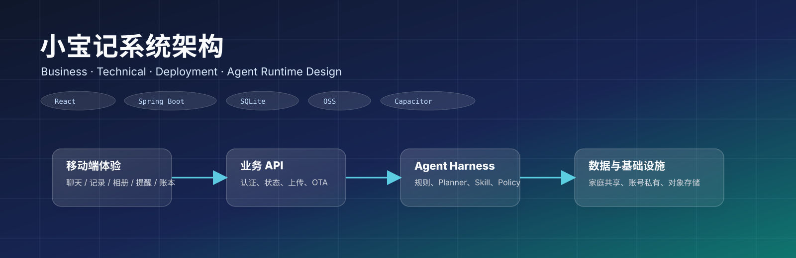
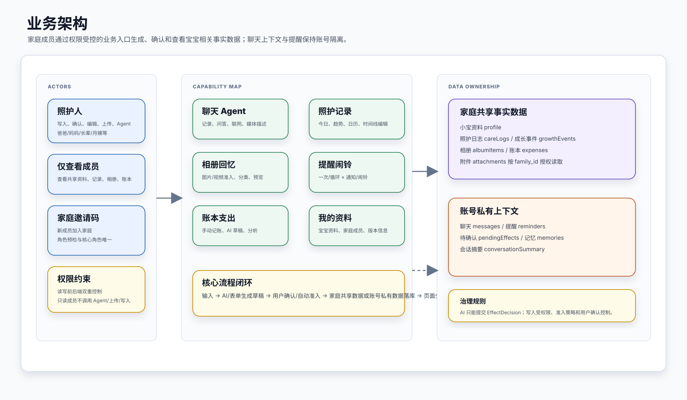
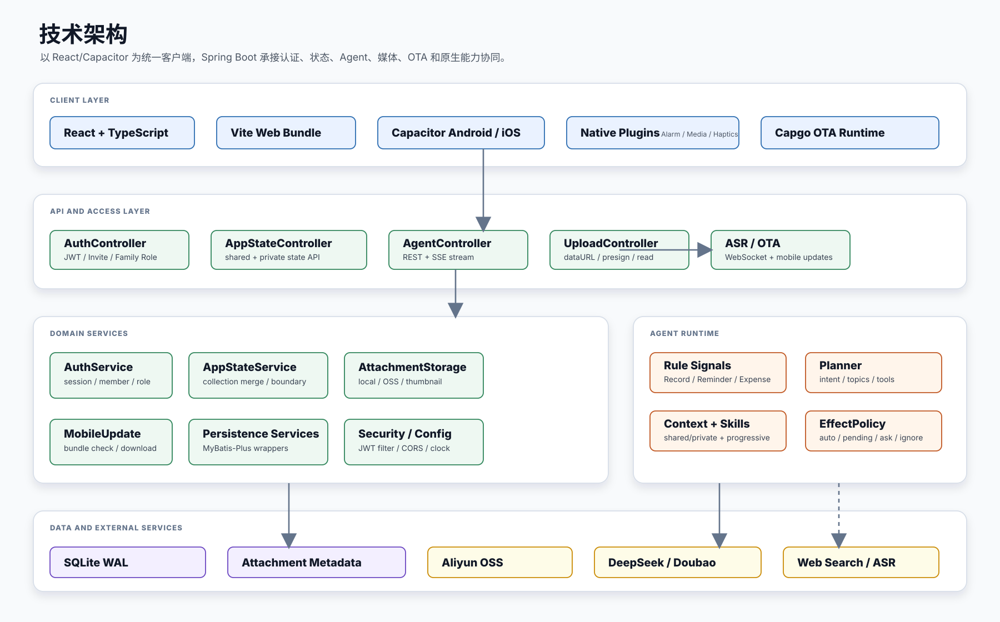
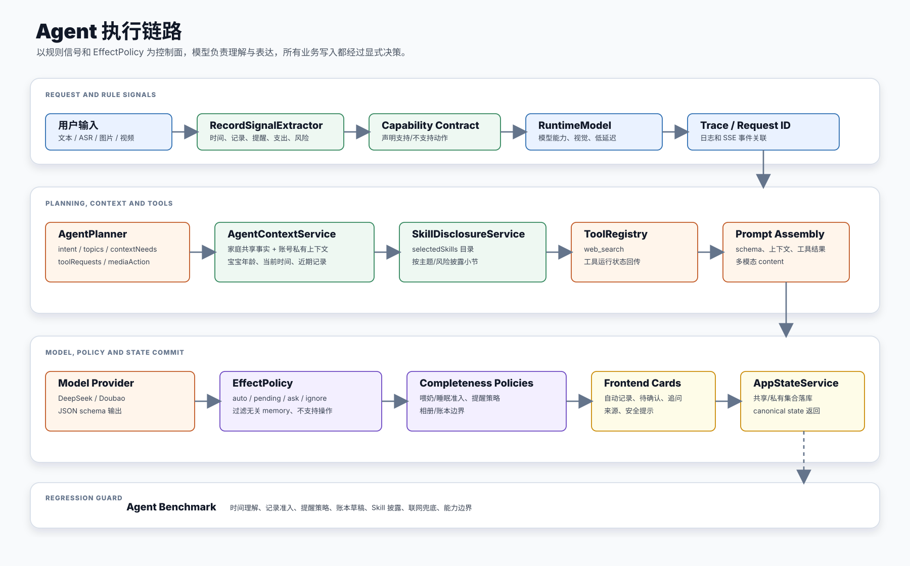
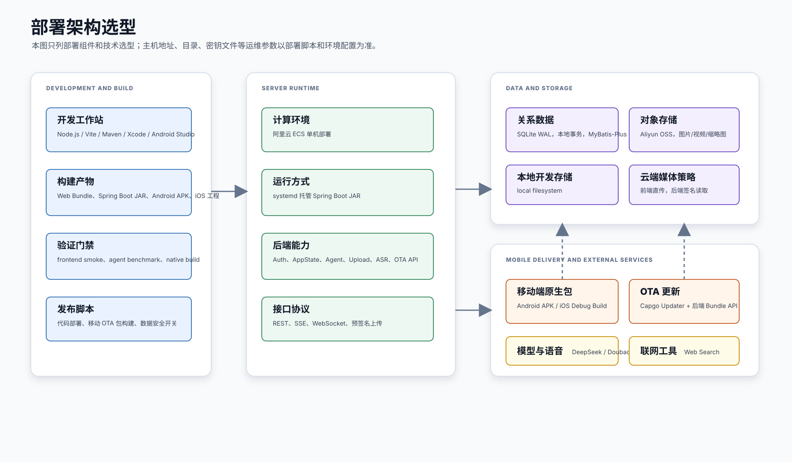

# 小宝记系统架构文档

更新时间：2026-05-13

## 1. 文档目的

本文档描述“小宝记”的业务架构、技术架构和部署架构，帮助后续研发、测试、Agent harness 和运维工作统一理解系统边界。

当前系统定位为家庭私有部署/云端单机部署的宝宝成长记录 App。核心能力包括：

- 家庭邀请码登录与成员权限。
- AI Agent 聊天、自动记录、待确认草稿、联网查询和基础育儿 skill 披露。
- 照护记录、成长事件、相册、提醒、账本。
- Android / iOS Capacitor 原生壳、媒体能力、语音输入、通知/闹铃和 OTA 更新。
- 后端 Spring Boot + SQLite + local/OSS 附件存储。

## 2. 业务架构

### 2.1 业务角色

系统围绕“家庭”组织成员和数据：

| 角色 | 能力 |
| --- | --- |
| 照护人 | 可聊天、上传媒体、记录照护日志、确认待确认草稿、创建/完成/删除提醒、管理相册、管理账本、编辑小宝资料。 |
| 仅查看成员 | 可查看家庭共享的小宝资料、照护记录、相册和账本，不可调用 Agent/ASR/上传/写入接口。 |
| 家庭邀请码 | 同一个邀请码可加入同一家庭；核心亲属角色爸爸、妈妈、爷爷、奶奶、外公、外婆在家庭内唯一。 |

### 2.2 业务功能域

| 功能域 | 主要入口 | 业务说明 |
| --- | --- | --- |
| 登录与家庭 | 登录页、我的页 | 手机号 + 家庭邀请码登录；新成员首次选择身份和是否照护人；首位照护人补齐小宝资料和家庭名称。 |
| 聊天与 Agent | 聊天 Tab | 支持文本、语音转文字、图片/视频理解、联网查询、记录/提醒/账本/相册意图识别。 |
| 照护记录 | 记录 Tab | 今日、趋势、日历三种视图；奶量、睡眠、便便、体温、辅食等结构化时间线。 |
| 提醒与闹铃 | 提醒 Tab | 一次/循环 × 通知/闹铃的统一策略；移动端原生调度。 |
| 相册 | 相册 Tab | 只展示值得保存的图片/视频媒体项；截图、网页、纯 UI 图片不进入成长相册。 |
| 账本 | 账本 Tab | 记录宝宝相关支出，展示本月、年度、明细分析；AI 只能生成待确认草稿。 |
| 我的 | 我的 Tab | 小宝资料、家庭成员、我的身份、运行版本、退出登录。 |

### 2.3 数据共享边界

系统的数据隔离是业务架构的核心：

| 数据类型 | 边界 | 说明 |
| --- | --- | --- |
| `profile` | 家庭共享 | 小宝资料和家庭基础信息。 |
| `careLogs` | 家庭共享 | 照护日志和时间线事实。 |
| `growthEvents` | 家庭共享 | 成长事件。 |
| `albumItems` | 家庭共享 | 已保存的相册媒体。 |
| `expenses` | 家庭共享 | 账本支出。 |
| `attachments` | 家庭授权 | 附件按 `family_id` 校验，同家庭成员可读，照护人才可上传/删除。 |
| `messages` | 账号私有 | 聊天历史不在家庭内共享。 |
| `reminders` | 账号私有 | 每个账号自己的提醒和闹铃。 |
| `pendingEffects` | 账号私有 | AI 待确认卡片只属于当前账号。 |
| `memories` | 账号私有 | Agent 长期记忆属于当前账号。 |
| `conversationSummary` | 账号私有 | 会话摘要不跨账号共享。 |

## 3. 技术架构

### 3.1 前端与移动壳

前端使用 React + TypeScript + Vite，核心业务集中在 `src/App.tsx`，并通过多个 API/原生桥模块连接后端与移动端能力：

| 模块 | 职责 |
| --- | --- |
| `src/authApi.ts` | 登录、邀请码角色预检、当前用户、家庭名称、退出登录。 |
| `src/appStateApi.ts` | 应用状态读取、集合 upsert/delete、附件上传、OSS 预签名直传。 |
| `src/agentApi.ts` | Agent 普通请求与 SSE 流式请求、会话摘要压缩。 |
| `src/asrApi.ts` | ASR WebSocket 客户端。 |
| `src/nativeAlarm.ts` | Android/iOS 原生提醒和闹铃插件桥。 |
| `src/nativeMediaPicker.ts` | iOS/Android 原生媒体选择。 |
| `src/mobileUpdates.ts` | Capgo OTA 检查、下载、进度提示和切换。 |
| `src/types.ts` | 前后端共享的主要领域类型。 |

移动端通过 Capacitor 复用同一套 Web 业务代码：

- Android：`android/app/src/main` 下有闹铃、权限、媒体等原生实现和资源。
- iOS：`ios/App/App` 下有 `AlarmReminderPlugin.swift`、`NativeMediaPickerPlugin.swift` 和启动图/AppIcon 资源。
- OTA：原生壳固定，前端 bundle 可通过 `/api/mobile-updates/check` 下发更新。

### 3.2 后端分层

后端是 Spring Boot 应用，主要分为：

| 层 | 代表代码 | 职责 |
| --- | --- | --- |
| Controller | `controller/*` | 暴露 REST/SSE/WebSocket API。 |
| Auth | `auth/*` | 手机号登录、邀请码、家庭成员、JWT、会话、权限。 |
| App State | `service/AppStateService.java` | 合并家庭共享和账号私有状态，负责集合读写、确认/丢弃、附件引用清理。 |
| Agent | `agent/*` | Planner、规则信号、上下文、Skill、工具、模型运行、效果决策。 |
| ASR | `asr/*` | 豆包实时语音识别 WebSocket 协议适配。 |
| Upload | `service/AttachmentStorageService.java` | local/OSS 附件存储、预签名、缩略图、权限校验。 |
| OTA | `service/MobileUpdateService.java` | 移动端 bundle 检查与下载资源。 |
| Persistence | `persistence/*` | SQLite 表初始化、MyBatis-Plus entity/mapper/service。 |

### 3.3 外部模型和工具

| 外部能力 | 当前用途 |
| --- | --- |
| DeepSeek Chat | 文本 Agent、Planner、摘要等普通模型能力。 |
| Doubao Seed 2.0 Pro/Lite | 多模态图片/视频理解、低延迟 service tier。 |
| Doubao ASR | 按住说话实时转文字。 |
| Web Search Tool | 政策、官方信息、价格/商品信息等需要外部验证的问题。 |
| Aliyun OSS | 云端图片、视频、音频和缩略图对象存储。 |

### 3.4 持久化

后端启动时由 `DatabaseInitializer` 创建/迁移 SQLite 表：

| 表族 | 表 |
| --- | --- |
| 认证 | `auth_user`、`auth_family`、`auth_family_member`、`auth_invite_code`、`auth_session` |
| 应用状态 | `baby_profile`、`chat_message`、`growth_event`、`care_log`、`reminder`、`memory_item`、`pending_effect`、`album_item`、`expense_item`、`conversation_summary` |
| 文件 | `attachment` |

SQLite 配置启用：

- `PRAGMA journal_mode=WAL`
- `PRAGMA synchronous=NORMAL`
- `PRAGMA busy_timeout=10000`
- `PRAGMA foreign_keys=ON`

## 4. Agent 架构总览

Agent 不是“模型直接决定写库”，而是一条有规则兜底和准入控制的链路：

1. 前端提交用户输入、附件、最近消息、小宝资料和模型选择。
2. `RecordSignalExtractor` 用确定性规则提取照护、提醒、支出、风险、撤销边界等信号。
3. `AgentPlanner` 让模型规划 intent、topics、contextNeeds、toolRequests 和 mediaAction；解析失败时回退到 heuristic。
4. `AgentContextService` 读取家庭共享状态和当前账号私有上下文。
5. `SkillDisclosureService` 根据主题/风险渐进披露育儿 skill 小节。
6. `ToolRegistry` 执行 web_search 等工具，并通过 SSE 把工具状态发回前端。
7. `AgentRuntime` 调用 DeepSeek/Doubao，要求返回固定 JSON schema。
8. `EffectPolicy` 和 `CareEventCompletenessPolicy` 决定效果是 `auto`、`pending`、`ask` 还是 `ignore`。
9. 前端显示 AI 正文、工具活动、来源、安全提示和效果卡片；可自动写入或等待用户确认。
10. `AppStateService` 按家庭共享/账号私有边界持久化。

详细设计见 [agent-detailed-design.md](agent-detailed-design.md)。

## 5. 部署架构

### 5.1 部署选型

| 层级 | 选型 | 说明 |
| --- | --- | --- |
| 客户端 | React + Capacitor | WebView 复用前端业务代码，Android/iOS 通过原生插件补齐能力。 |
| 服务端 | Spring Boot 单体应用 | 统一承载认证、状态、Agent、上传、ASR 和 OTA API。 |
| 运行环境 | 阿里云 ECS 单机 | 当前阶段保持简单部署，不引入负载均衡或容器编排。 |
| 关系数据 | SQLite WAL | 适合当前单家庭/小规模测试场景，启动时自动迁移表结构。 |
| 对象存储 | local / Aliyun OSS | 本地开发使用 local，云端媒体使用 OSS 直传和签名读取。 |
| 移动更新 | Capgo OTA Bundle | 前端资源和样式可热更新；原生能力变更仍需重新发包。 |
| 外部模型 | DeepSeek / Doubao / Doubao ASR | 文本、多模态、低延迟和实时语音转写能力。 |
| 运维方式 | 部署脚本 + systemd | 具体主机、端口、目录、密钥文件等参数以部署脚本和环境变量为准。 |

部署架构图只表达选型和组件关系，不记录 IP、目录和密钥路径，避免架构文档与实际运维参数漂移。

### 5.2 本地开发与验证

| 能力 | 命令 |
| --- | --- |
| 前端开发 | `npm run dev` |
| 前端构建 | `npm run build` |
| 前端验证 | `npm run verify:frontend` |
| Agent benchmark | `npm run test:agent-benchmark` |
| Android debug 包 | `npm run build:android:debug` |
| iOS debug 构建 | `npm run build:ios:debug` |
| 移动 OTA Bundle | `npm run build:mobile:update` |

云端代码发布默认应保持数据安全，不同步或覆盖生产数据；具体命令以 `scripts/deploy-aliyun-ecs.sh` 和当前环境变量为准。

### 5.3 附件存储

系统支持两种附件模式：

| 模式 | 适用场景 | 行为 |
| --- | --- | --- |
| `local` | 本地开发、小规模单机 | 文件写入后端数据目录，后端直接读取返回。 |
| `oss` | 云端环境 | 前端向后端申请预签名 URL，直传 OSS，后端保存元数据和签名读取入口。 |

云端建议使用 OSS，减少 ECS 带宽和磁盘压力；SQLite 只存附件元数据，不存原始二进制。

### 5.4 移动端更新

原生包承担：

- WebView 容器。
- 原生闹铃、通知、权限、媒体选择。
- 固定 AppIcon、启动图、原生资源。

OTA Bundle 承担：

- React 页面、样式、前端逻辑。
- 部分静态 Web 资产。

因此：

- 改 UI 和大部分前端逻辑：可通过 OTA。
- 改原生权限、插件、App 图标、启动页、Android/iOS 原生代码：必须重新发包。

## 6. 安全和权限

### 6.1 接口权限

| 接口 | 权限 |
| --- | --- |
| `/api/auth/login`、`/api/auth/invite/roles` | 公开，但有邀请码校验和登录频控。 |
| `/api/auth/me`、`/api/app/state`、附件读取 | 登录成员可读。 |
| `/api/agent/**`、`/api/asr/stream`、上传、状态写入、确认/丢弃 | 仅照护人。 |
| `/api/mobile-updates/**` | 原生更新检查公开，不暴露业务数据。 |

### 6.2 数据安全原则

- 家庭共享只限事实数据：资料、照护/成长、相册、账本。
- 私有上下文不跨账号：聊天、提醒、记忆、待确认、摘要。
- 附件读取必须校验 `family_id`。
- Agent 不能绕过 `EffectPolicy` 直接写库。
- 云端部署默认不覆盖数据。

## 7. 验证和质量门禁

| 改动类型 | 最小验证 |
| --- | --- |
| Agent 规则、Prompt、Effect、Planner | `npm run test:agent-benchmark` |
| 前端构建/type | `npm run build` |
| UI、移动布局、弹层、键盘 | `npm run verify:frontend` |
| 后端状态/权限/持久化 | Maven 单测或定向集成测试 |
| Android/iOS 原生能力 | `npm run mobile:sync` + 对应平台 debug build |
| 云端发布 | `/api/health` + 真实行为或 DB/journal/probe 证据 |

## 8. 已知架构约束

- 当前云端仍是单机 Spring Boot + SQLite，不做负载均衡和托管数据库。
- iOS 后台无法像 Android 一样强制全屏闹铃，采用本地通知 + 点击进入闹铃页的可达等价策略。
- Agent 真实模型输出有不确定性，因此核心行为依赖规则层和 benchmark 保护。
- `src/App.tsx` 仍然较大，后续可按功能面拆分组件和 hooks，但不应在无需求时大改。
